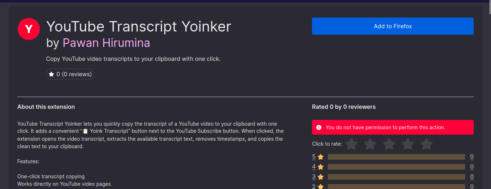

## Youtube Transcript Yoinker (v1.0.0)

- this is a personal project, what it does is it copies any ```youtube``` 
video you your system clipboard with just one click

- it only works on the videos that has a transcript so you don't have to waste your time opening the panel and then trying to copy and pull down the whole transcript section. 

## Stack used 

- Html
- Css 
- Javascript 

## ScreenShots


