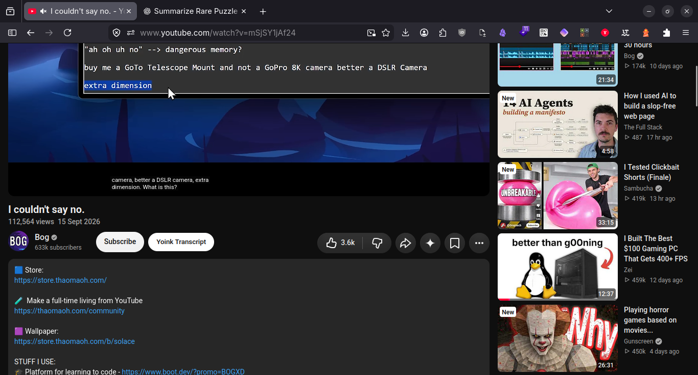
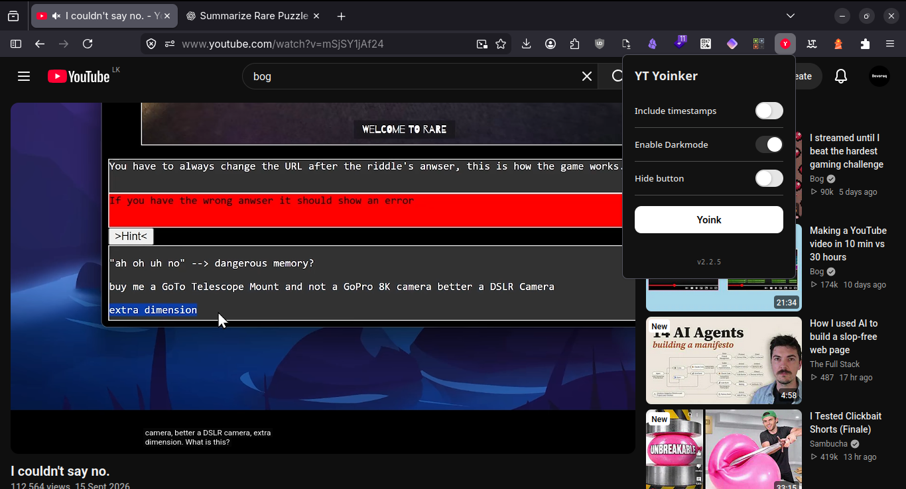

# 🎥 YouTube Transcript Yoinker  
**Version:** v2.3.5  

Copy YouTube video transcripts to your system clipboard with a single click—no account, no external service required.

---

## 📖 Overview

YouTube Transcript Yoinker is a lightweight **Firefox web‑extension** that:

* Detects if a YouTube video has an automatically generated or user‑provided transcript.  
* Adds a **“Copy Transcript”** button directly in the YouTube UI.  
* Copies the full transcript (including timestamps) to the system clipboard in one go.  

> **Why?**  
Manually opening YouTube’s transcript panel, selecting all text, and copying it is tedious. Yoinker does it instantly, saving you time when you need the text for notes, research, subtitles, or any other purpose.

---

## ✨ Features

| Feature | Description |
|---------|-------------|
| **One‑click copy** | A single button copies the entire transcript to the clipboard. |
| **Works only when a transcript exists** | The button appears only for videos that actually have a transcript, avoiding dead clicks. |
| **No external services** | All processing happens locally in the browser—your data never leaves your machine. |
| **Lightweight** | < 15 KB packed size, minimal impact on page load. |
| **Cross‑platform** | Works on any OS that runs Firefox (Windows, macOS, Linux). |
| **Open‑source** | Fully transparent code on GitHub. |

---

## 🛠️ Stack

- **HTML**
- **CSS**
- **JavaScript** (WebExtension APIs)

---

## 📦 Installation

### From Mozilla Add‑Ons (recommended)

1. Visit the **[Yoinker extension page on AMO](https://addons.mozilla.org/en-US/firefox/addon/yt-transcript-yoinker/)**.  
2. Click **“Add to Firefox”** and follow the prompts.  
3. The extension will be added to your toolbar automatically.

### Manual (unpacked) installation (for developers)

1. Clone or download the repository:  

   ```bash
   git clone https://github.com/pawanhirumina/yt-transcript-yoinker.git
   ```

2. Open **`about:debugging#/runtime/this-firefox`** in Firefox.  
3. Click **“Load Temporary Add‑on…”** and select the `manifest.json` file inside the repo folder.  
4. The extension will be loaded for the current session (it disappears after a browser restart).

---

## 🚀 Usage

1. Navigate to any **YouTube video** that has a transcript (most videos do).  
2. You’ll see a **“Copy Transcript”** button added next to the video title / description.  
3. Click the button → the entire transcript (plain text) is copied to your system clipboard.  
4. Paste (`Ctrl+V` / `Cmd+V`) wherever you need it.

*If the button does not appear, the video does not have a transcript.*

---

## 📸 Screenshots





*The “Copy Transcript” button appears in the YouTube UI.*

---

## 🤝 Contributing

Contributions are welcome! If you’d like to improve Yoinker:

1. Fork the repository.  
2. Create a new branch (`git checkout -b feature/awesome-feature`).  
3. Make your changes and commit (`git commit -am 'Add awesome feature'`).  
4. Push the branch (`git push origin feature/awesome-feature`).  
5. Open a Pull Request describing your changes.

Please follow the existing coding style and include tests/documentation when appropriate.

---

## 📜 License

This project is licensed under the **MIT License** – see the `LICENSE` file for details.

---

## 📬 Contact & Support

- **GitHub Issues:** <https://github.com/pawanhirumina/yt-transcript-yoinker/issues>  
- **Author:** [pawanhirumina](https://github.com/pawanhirumina)  

Feel free to open an issue for bugs, feature requests, or general questions.

---

## 🔗 Useful Links

- **GitHub Repository:** <https://github.com/pawanhirumina/yt-transcript-yoinker>  
- **Live Demo / Documentation Site:** <https://pawanhirumina.github.io/yt-transcript-yoinker/>  
- **Mozilla Add‑Ons Page:** <https://addons.mozilla.org/en-US/firefox/addon/yt-transcript-yoinker/>  

---

*Happy transcript yoinking!* 🎉
